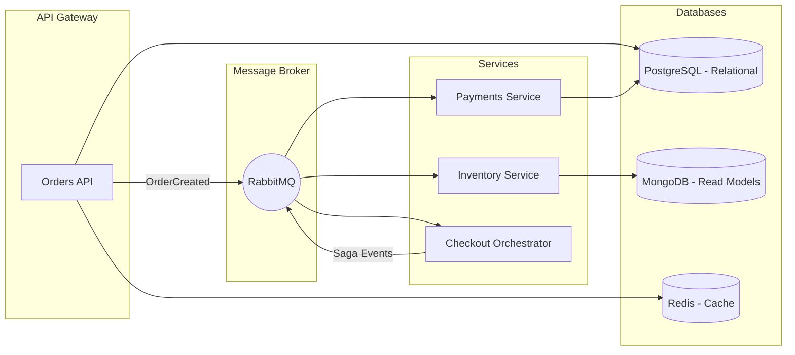

## 🪐 **Mercury Platform**

### *A distributed event-driven backend architecture built with .NET 8, RabbitMQ, PostgreSQL, MongoDB, and Redis.*

---

### 🦭 Overview

**Mercury Platform** is an advanced **backend microservices system** designed to demonstrate clean architecture, event-driven communication, and modern cloud-ready design patterns.
It integrates **RabbitMQ** for asynchronous message processing, leverages **CQRS + DDD** for domain separation, and uses **three database technologies** — relational, document, and cache — to achieve performance and scalability.

The platform simulates an **order processing system**, orchestrating multiple services (Orders, Payments, Inventory) through **events, sagas, and message queues**.

---

### 🎗️ Architecture



---

### ⚙️ Tech Stack

| Category                 | Technology                                                          |
| ------------------------ | ------------------------------------------------------------------- |
| **Language / Framework** | C#, .NET 8 (ASP.NET Core Web API)                                   |
| **Messaging**            | RabbitMQ (MassTransit integration)                                  |
| **Databases**            | PostgreSQL (write model), MongoDB (read model), Redis (cache/store) |
| **Architecture**         | CQRS, DDD, Saga, Event-Driven, Repository, Mediator                 |
| **Libraries**            | MediatR, AutoMapper, EF Core, Polly, Serilog, OpenTelemetry         |
| **Testing**              | xUnit, Moq, Testcontainers, Pact                                    |
| **DevOps / CI**          | Docker, docker-compose, GitHub Actions, Terraform (IaC)             |
| **Observability**        | Prometheus, Grafana, OpenTelemetry Tracing                          |
| **Auth / Security**      | JWT / ASP.NET Identity (optional)                                   |

---

### 🔁 Core Features

✅ Distributed event-driven communication
✅ CQRS + DDD with isolated bounded contexts
✅ Reliable event publishing (with outbox pattern)
✅ Sagas for long-running orchestration (Order → Payment → Inventory)
✅ Retry, Circuit Breaker, Idempotency
✅ Redis caching and distributed locks
✅ OpenTelemetry tracing and metrics
✅ Integration tests using Testcontainers
✅ Containerized environment with docker-compose
✅ CI/CD pipeline with GitHub Actions

---

### 🥫 Service Overview

| Service                   | Description                                     | Primary Storage  |
| ------------------------- | ----------------------------------------------- | ---------------- |
| **Orders API**            | Manages order lifecycle, publishes events       | PostgreSQL       |
| **Inventory Service**     | Handles stock levels, reacts to order events    | MongoDB          |
| **Payments Service**      | Simulates payment authorization and capture     | PostgreSQL       |
| **Checkout Orchestrator** | Implements Saga to coordinate distributed steps | RabbitMQ         |
| **Notification Worker**   | Sends asynchronous notifications                | RabbitMQ + Redis |

---

### 🐳 Local Setup

#### Requirements

* Docker & Docker Compose
* .NET 8 SDK
* Make (optional, for scripts)

#### Run with Docker

```bash
git clone https://github.com/yourusername/mercury-platform.git
cd mercury-platform
docker-compose up --build
```

#### Available Services

| Service             | URL                                                            |
| ------------------- | -------------------------------------------------------------- |
| Orders API          | [http://localhost:5000/swagger](http://localhost:5000/swagger) |
| RabbitMQ Management | [http://localhost:15672](http://localhost:15672)               |
| PostgreSQL          | localhost:5432                                                 |
| MongoDB             | localhost:27017                                                |
| Redis               | localhost:6379                                                 |

---

### 🥪 Running Tests

```bash
dotnet test
```

You can also run integration tests in containers:

```bash
dotnet test --filter Category=Integration
```

---

### 🛠️ CI/CD (GitHub Actions)

The repository includes a workflow that:

* Builds and tests all services
* Runs code analysis (dotnet format, lint)
* Builds and pushes Docker images
* Deploys to a test environment (via Terraform/Helm)

---

### 🔍 Observability

| Tool              | Purpose                              |
| ----------------- | ------------------------------------ |
| **Serilog**       | Structured logging                   |
| **OpenTelemetry** | Traces and metrics                   |
| **Prometheus**    | Metrics scraping                     |
| **Grafana**       | Dashboards                           |
| **Health Checks** | `/health` endpoints for all services |

---

### 🟞️ Roadmap

* [x] Define base architecture
* [x] Create dockerized infrastructure (Postgres, Mongo, Redis, RabbitMQ)
* [ ] Implement Orders API + CQRS
* [ ] Integrate RabbitMQ and event publishing
* [ ] Add Inventory and Payments services
* [ ] Implement Saga orchestration
* [ ] Add OpenTelemetry tracing and metrics
* [ ] Create GitHub Actions CI/CD
* [ ] Publish documentation and demo video

---

### 🧠 Design Patterns Used

* Repository / Unit of Work
* Mediator (MediatR)
* Factory / Strategy (Payment Providers)
* Saga (Order Orchestration)
* CQRS (Command + Query separation)
* Outbox Pattern (Reliable Event Publishing)
* Retry / Circuit Breaker (Polly)
* Distributed Cache / Lock (Redis)

---

### 🧉 Example Command Flow

1. **POST /orders** → `CreateOrderCommand`
2. Orders service stores data in PostgreSQL
3. Publishes `OrderCreated` event to RabbitMQ
4. Inventory & Payments services process event
5. Saga Orchestrator coordinates final state
6. `OrderCompleted` event is published

---

### 🏁 Project Structure (Preview)

```
/mercury-platform
 ├─ /docs
 ├─ /deploy
 ├─ /docker
 ├─ /services
 │   ├─ orders-api
 │   ├─ inventory-service
 │   ├─ payments-service
 │   ├─ checkout-orchestrator
 │   └─ workers/notification
 ├─ /libs
 │   ├─ common
 │   └─ domain
 ├─ /tests
 ├─ docker-compose.yml
 ├─ README.md
 └─ .github/workflows/ci.yml
```

---

### 📈 Example Badges (add after first CI setup)

```


```

---

### 📜 License

This project is licensed under the [MIT License](LICENSE).

---

### 🌌 Inspiration

Mercury, the messenger of the gods, symbolizes **speed, communication, and reliability** — exactly what modern distributed backends strive for.
